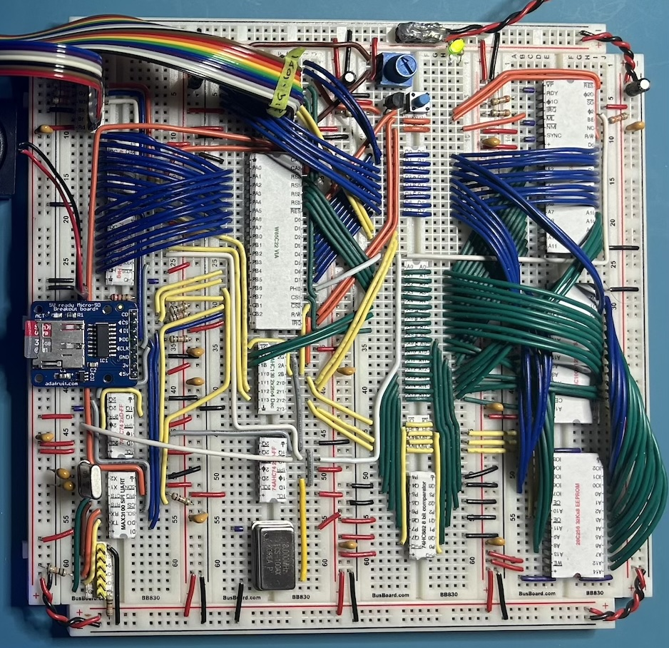
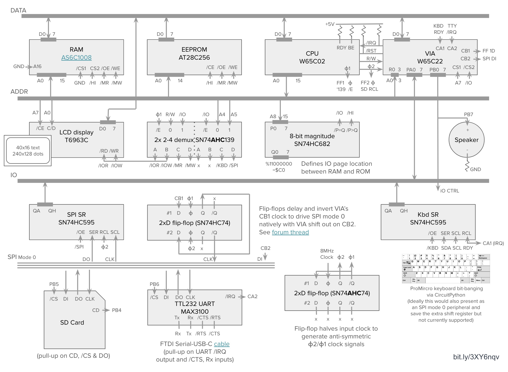

&micro;65c02
===

This repo documents the hardware and software for micro-colossus.
This is a [Ben Eater](https://www.youtube.com/@BenEater)-inspired build
to run a native port of [Colossal Cave Adventure](https://en.wikipedia.org/wiki/Colossal_Cave_Adventure)
(repo: [advent-forth](https://github.com/patricksurry/advent-forth)).
The hardware is based on the W65C02 CPU with W65C22 VIA for IO management with
48Kb of RAM ($0-bfff), one page of IO ($c000-c0ff) and just under 16Kb
of ROM ($c100-ffff).
The current peripherals include a 40x16 text LCD (and/or 240x128 graphics),
a mechanical keyboard bit-banging with CircuitPython,
a one-bit speaker, an SD card reader and a USB-TTY serial interface.
The kernel is built on a lightly modified version of [TaliForth2](https://github.com/SamCoVT/TaliForth2/).

Physical Layout
---

Schematic
---

Parts list
---

Qty | Description
:---: | :---
4	| Breadboard (remove a power rail from all but one)
1	| 22 AWG solid hook-up wire (6+ colors)
1	| W65C02 CPU
1	| W65C22 VIA
1	| AT28C256 EEPROM
1   | AS6C1008 128Kx8 SRAM (1Mbit)
1	| 2, 4 or 8 Mhz crystal oscillator
1   | 74HC682 8 bit comparator w/ inequality
1   | 74AHC139* 2x 2-to-4 decoder
2   | 74AHC74* 2x D flip-flop
2   | 74HC595 shift register
1   | 240x128 T6963C LCD display (w/ onboard font data for 40x16 text)
1   | 10kΩ potentiometer (for LCD panel contrast)
1   | tactile pushbutton switch for reset
1   | DS1813-5 econo-reset
1   | Keyboard running CircuitPython
1   | MicroSD card breakout (SPI mode 0 SD interface)
15  | 3.3-10KkΩ pull-up resistors
12  | 100nF (0.1µF) bypass capacitors (near VCC for each IC)
5   | 10µF bypass capacitors (one on each power rail)
|    | (optional) |
1   | MAX3100 UART (SPI mode 0 TTL-232 interface)
1   | ECS-18-13-1X 1.8432MHz crystal oscillator
2   | 20pF capacitors for oscillator
1   | FTDI serial TTL-232 cable (USB type A or C as needed)
1   | Green LED
1   | 8Ω 3W 5V mini speaker
2   | 220Ω resistor (speaker, LED)

Note: The HC logic family seems to work fine in practice but at least the '139 and '74 should be AHC to stay in spec for W65C02 timing.

https://nullbits.co/

https://github.com/klemens-u/ic-label-creator (https://github.com/patricksurry/ic-label-creator)
TODO
---

- [ ] sometimes there's a long wait on startup, some LCD reset/ready issue?
- [ ] should use emit_a instead of kernel_putc in txt_* for better tty interaction
- [x] add SREC> ( -- xt f ) word to parse 64tass `--s-record` output
- [ ] add >SREC ( addr u -- ) to generate SRECORD output
- [ ] merge DIGIT? with convert_hex_value and chr2nbl
- [x] fix CLEAVE using is_whitespace
- [ ] drop -LEADING/-TRAILING as extras?