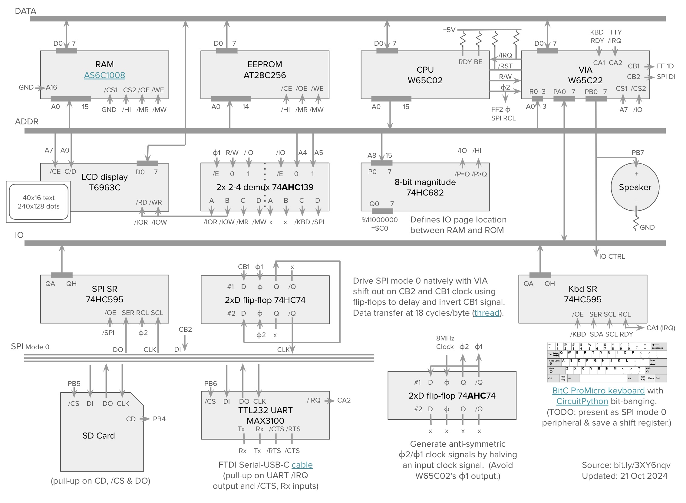

&micro;65c02
===

This repo documents the hardware and software for my &micro;65c02, aka `micro-colossus`.
This is a [Ben Eater](https://www.youtube.com/@BenEater)-inspired build
that runs [Colossal Cave Adventure](https://en.wikipedia.org/wiki/Colossal_Cave_Adventure).
If you just want to play the game on a simulated 65c02 without building
the hardware, see [`advent-forth`](https://github.com/patricksurry/advent-forth).

The hardware is based on the W65C02 CPU with W65C22 VIA for IO management with
48Kb of RAM ($0-bfff), one page of IO ($c000-c0ff) and just under 16Kb
of ROM ($c100-ffff).
Peripherals currently include a 40x16 text LCD (and/or 240x128 graphics),
a kit-built mechanical keyboard bit-banging with CircuitPython,
a one-bit speaker, an SD card reader and a USB-TTY serial interface.
The kernel is built on a lightly modified version of [TaliForth2](https://github.com/SamCoVT/TaliForth2/),
found in my [`adventure` branch](https://github.com/patricksurry/TaliForth2/tree/adventure).

Useful links
---

- You should read Garth Wilson's [6502 primer](http://wilsonminesco.com/6502primer/),
  probably more than once.

- My keyboard is the [nullbits nibble kit](https://nullbits.co/nibble/) - I love it!

- I found these printable [IC labels](https://github.com/klemens-u/ic-label-creator)
  which are easy to cut out and attach with a glue stick.  I find them very helpful
  for "visual debugging".
  I've made some changes in [my fork](https://github.com/patricksurry/ic-label-creator).

- The [6502 forum](http://forum.6502.org/) is a great source of ideas and advice
    along with [`r/beneater`](https://www.reddit.com/r/beneater/).

Physical Layout
---

This is a reasonably current photo of the actual build.
I've since added a 100µF bypass capacitor across the +5V input power connector
which helps stabilize startup time.
In case of any discrepancy with the schematic the physical build is obviously definitive.
Please let me know and I'll fix the schematic.

Schematic
---

This is a simplified schematic for the build, showing the organization
around the data, address, IO and SPI buses.   For clarity I don't show all
connections (labels should match), and omit pins in obvious
groupings (like D0...D7) along with VCC (+5V) and ground.

As with any breadboard build, make sure you have sufficient power distribution as
well as bypass capacitors near every IC's power source, on each power rail, and across
the input power connection (see parts list).
Garth Wilson's [6502 primer](http://wilsonminesco.com/6502primer/)
has a great discussion of [power issues](https://wilsonminesco.com/6502primer/construction.html)
including his #1 tip: *avoid solderless breadboards* :-)

I've tested successfully up to 4MHz (halved 8MHz input clock) *once* I learned to
avoid the W65C02's output &phi;1 in favor of a symmetric halved clock input.
Also make sure you use all ICs from the same logic family.
In practice I found that 74HCxxx worked fine, though I've switched a couple
of components as noted to 74AHCxxx in order to strictly meet the timing specs.

The IO page address decoding configurable: I use $C0xx but you can
modify based on your ROM v RAM needs by changing the fixed inputs to the '682.
I found this design in a [6502 forum discussion](http://forum.6502.org/viewtopic.php?p=88176#p88176)
which includes much nicer diagrams.  Again Garth's section on
[address decoding](http://wilsonminesco.com/6502primer/addr_decoding.html)
is a must read.

Parts list
---

Qty | Description
:---: | :---
4	| Breadboard (remove a power rail from all but one)
1	| 22 AWG solid hook-up wire (6+ colors)
1	| W65C02 CPU
1	| W65C22 VIA
1	| AT28C256 EEPROM
1   | AS6C1008 128Kx8 SRAM (1Mbit)
1	| 2, 4 or 8 Mhz crystal oscillator
1   | 74HC682 8 bit comparator w/ inequality
1   | 74AHC139* 2x 2-to-4 decoder
2   | 74AHC74* 2x D flip-flop
2   | 74HC595 shift register
1   | 240x128 T6963C LCD display (w/ onboard font data for 40x16 text)
1   | 10kΩ potentiometer (for LCD panel contrast)
1   | tactile pushbutton switch for reset
1   | DS1813-5 econo-reset
1   | Keyboard running CircuitPython
1   | MicroSD card breakout (SPI mode 0 SD interface)
15  | 3.3-10KkΩ pull-up resistors
12  | 100nF (0.1µF) bypass capacitors (near VCC for each IC)
5   | 10µF bypass capacitors (one on each power rail)
1   | 100µF bypass capacitor (where external +5V power connects)
|   | (optional) |
1   | MAX3100 UART (SPI mode 0 TTL-232 interface)
1   | ECS-18-13-1X 1.8432MHz crystal oscillator
2   | 20pF capacitors for oscillator
1   | FTDI serial TTL-232 cable (USB type A or C as needed)
1   | Green LED
1   | 8Ω 3W 5V mini speaker
2   | 220Ω resistor (speaker, LED)

Note: The HC logic family seems to work fine in practice but at least the '139 and '74 should be AHC to stay in spec for W65C02 timing.
Using AHC throughout should be fine.

